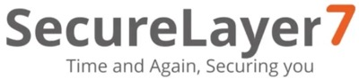

---

layout: col-sidebar
title: OWASP Austin
tags: austin

region: North America

altfooter: true
meetup-group: OWASP-Austin-Chapter
country: USA
postal-code: 78759

---
<!-- rebuild -->
<strong>Home Page</strong>
&nbsp;&nbsp;&nbsp;[Chapter Leadership](leadership.md)
&nbsp;&nbsp;&nbsp;[Study Groups](studygroups.md)
&nbsp;&nbsp;&nbsp;[Past Events](pastevents.md)
&nbsp;&nbsp;&nbsp;[Sponsorship](sponsorship.md)
&nbsp;&nbsp;&nbsp;[Event Archive](pasteventsarchive.md)

Welcome
-------
Welcome to the Austin chapter homepage.

### Upcoming Events ###

### Austin Security Professionals Happy Hour sponsored by SecureLayer7, July 11, 2024 ###

**When:** Thursday, July 11th, 5:30 pm - 7:30 pm

**Where:** Lavaca Street Bar at the Domain Northside (Rock Rose District), 11420 Rock Rose Ave #100, Austin, TX 78758.  We will have tables reserved inside the bar, to the right as you enter.  Parking: nearest parking in the Red Garage located off of Rock Rose Ave (<a href="https://domainnorthside.com/map/" target="_blank">map of Domain</a>). 

**What:** The Austin Security Professionals Happy Hour is a monthly event coordinated by the Austin OWASP Chapter and sponsored by various companies. We try to meet every second Thursday of the month from January to September (but occasionally we make schedule adjustments when needed). The event is an informal social gathering of local information security professionals. If you're involved with InfoSec or even if you have an interest, come on out for drinks, good food and conversation.

**Sponsor:** <a href="https://securelayer7.net" target="_blank">SecureLayer7</a>
  

<em>SecureLayer7 presents BugDazz: Empowering pentesting excellence for large enterprises and SMEs. Step into the future of cybersecurity with BugDazz and transform your strategy today. Trusted by leading organizations worldwide, elevate your pentesting program to new heights and ensure the security of your organization.</em>

 
Please RSVP so we can plan for number of attendees: 
<a href="https://www.meetup.com/owasp-austin-chapter/events/302000237/" target="_blank"> Meetup </a> 
  

[back to top](#welcome)

### OWASP Austin Chapter Meeting July 2024 ###

**When:** Tuesday, July 30th 2024 @ 11:45 AM - 1:00 PM 
Agenda: 
11:30-11:55 -- Room Opens, food is available and in-room discussions 
11:55-12:05 -- Chapter/OWASP info presentation 
12:05-1  -- Speaker Presentation 
 
**Presentation: Cyber Resilience - Findings from the 2024 Futures Report**

We are poised on the precipice of a new era of computing underpinned by new networks, new apps, and a digital-first experience.
Hear the latest findings from AT&T Cybersecurity research and learn about:
- What high-priority edge computing use cases are across seven industry markets
- How to secure and work with the edge ecosystem
- How the attack surface is changing
- How endpoints are diversifying
The data from this research helps audiences understand challenges and opportunities of the future and examines:
- Balanced investment strategies
- Collaboration and communication needs
- Building with dynamic cyber resilience in mind
Security is now a critical part of business - learn how to move your team to the future!

**Speaker:** 
Theresa Lanowitz
 
Theresa Lanowitz is a proven global influencer and speaks on trends and emerging technology poised to help today’s enterprise organizations flourish. Theresa is currently the head of cybersecurity evangelism at AT&T Business.
Prior to joining AT&T, Theresa was an industry analyst with boutique analyst firm voke and Gartner. While at Gartner, Theresa spearheaded the application quality ecosystem, championed application security technology, and created the successful Application Development conference.
As a product manager at Borland International Software, Theresa launched the iconic Java integrated development environment, JBuilder. While at Sun Microsystems, Theresa led strategic marketing for the Jini project – a precursor to IoT (Internet of Things).
Theresa’s professional career began with McDonnell Douglas where she was a software developer on the C-17 military transport plane and held a US Department of Defense Top Secret security clearance.
Theresa holds a Bachelor of Science in Computer Science from the University of Pittsburgh, Pittsburgh, PA

RSVP: 
RSVP:
Eventbrite (in-person RSVP) at Eventbrite @ 	
<a href="https://owasp-austin-2024-july-g1.eventbrite.com">Group1</a> or <a href="https://owasp-austin-2024-july-g2.eventbrite.com">Group2</a>
  
Meetup (online RSVP) on <a href="https://www.meetup.com/owasp-austin-chapter/events/298207014">Meetup</a>
 
[back to top](#welcome)

### LASCON 2024 ###

Save the Date for LASCON 2024. We will be back at Norris Conference Center with Pre-Conference Training October 22-23, 2024 and Conference October 24-25, 2024. Visit <a href="https://lascon.org/" target="_blank">lascon.org</a>.

<ul><li><a href="https://lascon.org/tickets/" target="_blank">Discounted tickets are available. Get yours today!</a></li>
<li>Call for Presentations (CFP) open until <strong>Saturday, June 1, 2024</strong>. <a href="https://lascon.org/cfp/" target="_blank">Submit your CFP today!</a></li>
<li>Call for Training (CFT) open until <strong>July 30, 2024</strong>. <a href="https://lascon.org/cft/" target="_blank">Submit your CFT today!</a></li>
<li>Interested in sponsoring LASCON 2024? <a href="https://lascon.org/become-a-sponsor/" target="_blank">Become a Sponsor.</a></li>
</ul>

[back to top](#welcome)

### Austin Security Professionals Happy Hour - 2024 Dates Available ###

> **Interested in Sponsoring? We are currently seeking happy hour sponsors for our monthly event. Please contact <a href="mailto:tiana.chandler@owasp.org?subject=OWASP Happy Hour Sponsor">Tiana Chandler</a> if you are interested. See our <a href="https://owasp.org/www-chapter-austin/sponsorship.html">Sponsorship</a> page for information on sponsoring.**

[back to top](#welcome)

Chapter Supporters
----------------
The following are the list of OWASP Corporate Members who have generously aligned themselves with the Austin chapter, therefore contributing funds to our chapter:

 &nbsp;&nbsp;

 
  

Meeting Supporters
----------------
The following are the list of organizations who have generously provided meeting space for the Austin chapter:

  

General Supporters
----------------
The following are the list of organizations who have generously provided additional assistance for the Austin chapter:

  

[back to top](#welcome)
