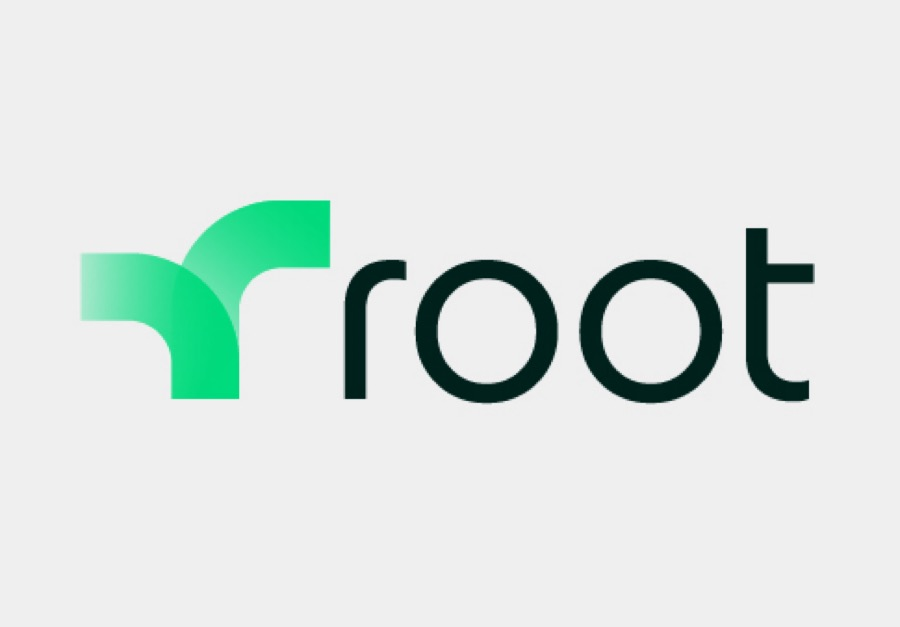

---

layout: col-sidebar
title: OWASP Austin
tags: austin

region: North America
state: Texas

altfooter: true
meetup-group: OWASP-Austin-Chapter
country: USA
postal-code: 78759

---
<!-- rebuild -->
<strong>Home Page</strong>
&nbsp;&nbsp;&nbsp;[Chapter Leadership](leadership.md)
&nbsp;&nbsp;&nbsp;[Study Groups](studygroups.md)
&nbsp;&nbsp;&nbsp;[Past Events](pastevents.md)
&nbsp;&nbsp;&nbsp;[Sponsorship](sponsorship.md)
&nbsp;&nbsp;&nbsp;[Event Archive](pasteventsarchive.md)

Welcome
-------
Welcome to the Austin chapter homepage.

### Upcoming Events ###

### OWASP Austin Chapter Meeting January 2026 - SAVE THE DATE ###
**When:** Tuesday, January 27, 2026 @ 11:30 AM - 1:00 PM 
Agenda: 
TBD

<!-- 11:30-11:55 -- Room Opens, food is available and in-room discussions 
11:55-12:05 -- Chapter/OWASP info presentation 
12:05-1  -- Speaker Presentation 
 
**Presentation: PRESENTATION-NAME**

The Secure Development Lifecycle (SDL) is a powerful construct that can advance security for both organizations with established security practices by shifting left, and immature organizations seeking a framework to implement security best practices in agile development. NI has been on a journey over the last several years to improve the security of its products driven by customer requirements, their expectations, and increasingly, regulations that require software to be developed with secure methodologies. Security is as much about a mindset and development culture as it is about tools, vulnerabilities, and security technologies. Learn how NI’s adoption of the Secure Development Lifecycle has created a framework for addressing various security challenges in web applications, microservices, and infrastructure.

**Speaker: SPEAKER-NAME** 
 
SPEAKER-BIO.

RSVP: 
In-person (and free lunch) at <a href="EVENTBRITE-LINK">Eventbrite</a>
  
Online RSVP at <a href="MEETUP-LINK">Meetup</a> -->
  

[back to top](#welcome)

### LASCON 2026 ###

Save the Dates for LASCON 2026. We will be back at Norris Conference Center with Pre-Conference Training October 27-28, 2026 and Conference October 29-30, 2026. Visit <a href="https://lascon.org/" target="_blank">lascon.org</a>.

<ul>
 <li>Get your Early Bird discounted conference tickets now. <a href="https://lascon.org/tickets/" target="_blank">Get yours today!</a></li>
 <li>Tickets for Pre-Conference Training are not yet available. <a href="https://lascon.org/pre-conf-training/" target="_blank">More information.</a></li>
 <li>Interested in sponsoring LASCON 2026? <a href="https://lascon.org/become-a-sponsor/" target="_blank">Become a Sponsor today!</a></li>
</ul>

[back to top](#welcome)

### Austin Security Professionals Happy Hour - 2026 Dates Available ###

> **Interested in Sponsoring? We are currently seeking happy hour sponsors for our monthly event. Please contact <a href="mailto:tiana.chandler@owasp.org?subject=OWASP Happy Hour Sponsor">Tiana Chandler</a> if you are interested. See our <a href="https://owasp.org/www-chapter-austin/sponsorship.html">Sponsorship</a> page for information on sponsoring.**

[back to top](#welcome)

<!--  FOLLOWING COMMENTED OUT FOR FUTURE USE

### OWASP Austin Chapter Meeting January 2025 ###
**When:** Tuesday, January 28, 2025 @ 11:30 AM - 1:00 PM 
Agenda: 
11:30-11:55 -- Room Opens, food is available and in-room discussions 
11:55-12:05 -- Chapter/OWASP info presentation 
12:05-1  -- Speaker Presentation 
 
**Presentation: PRESENTATION-NAME**

The Secure Development Lifecycle (SDL) is a powerful construct that can advance security for both organizations with established security practices by shifting left, and immature organizations seeking a framework to implement security best practices in agile development. NI has been on a journey over the last several years to improve the security of its products driven by customer requirements, their expectations, and increasingly, regulations that require software to be developed with secure methodologies. Security is as much about a mindset and development culture as it is about tools, vulnerabilities, and security technologies. Learn how NI’s adoption of the Secure Development Lifecycle has created a framework for addressing various security challenges in web applications, microservices, and infrastructure.

**Speaker: SPEAKER-NAME** 
 
SPEAKER-BIO.

RSVP: 
In-person (and free lunch) at <a href="EVENTBRITE-LINK">Eventbrite</a>
  
Online RSVP at <a href="MEETUP-LINK">Meetup</a>
  
[back to top](#welcome)

  -->

<!-- Following commented out for future HH events 

### Austin Security Professionals Happy Hour, TBD, 2026 ###

**When:** Thursday, TBD, 5:30 pm - 7:30 pm

**Where:** Lavaca Street Bar at the Domain Northside (Rock Rose District), 11420 Rock Rose Ave #100, Austin, TX 78758.

**What:** The Austin Security Professionals Happy Hour is a monthly event coordinated by the Austin OWASP Chapter and sponsored by various companies. We try to meet every second Thursday of the month from January to September (but occasionally we make schedule adjustments when needed). The event is an informal social gathering of local information security professionals. If you're involved with InfoSec or even if you have an interest, come on out for drinks, good food and conversation.

<blockquote>
Unfortunately we were not able to obtain a sponsor for this month’s Austin Security Professionals Happy Hour. With that, the September happy hour that was scheduled for this Thursday at the Lavaca Street Bar has been cancelled.
As a reminder, this was to be our last one for the year. We do not have our happy hour in October, November, or December. The next planned happy hour will be in January of next year. This of course is contingent upon obtaining a sponsor. If you know of any company who would like to sponsor, please direct them to the OWASP Austin Sponsorship page - https://owasp.org/www-chapter-austin/sponsorship.html. Thanks! 
</blockquote>

 

[back to top](#welcome)  -->

Chapter Supporters
----------------
The following are the list of OWASP Corporate Members who have generously aligned themselves with the Austin chapter, therefore contributing funds to our chapter:

 &nbsp;&nbsp;

 
  

Meeting Supporters
----------------
The following are the list of organizations who have generously provided meeting space for the Austin chapter:

  

General Supporters
----------------
The following are the list of organizations who have generously provided additional assistance for the Austin chapter:

  

[back to top](#welcome)
