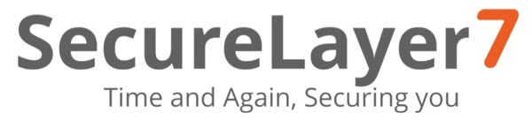

---

layout: col-sidebar
title: OWASP Austin
tags: austin

region: North America

altfooter: true
meetup-group: OWASP-Austin-Chapter
country: USA
postal-code: 78759

---
<!-- rebuild -->
<strong>Home Page</strong>
&nbsp;&nbsp;&nbsp;[Chapter Leadership](leadership.md)
&nbsp;&nbsp;&nbsp;[Study Groups](studygroups.md)
&nbsp;&nbsp;&nbsp;[Past Events](pastevents.md)
&nbsp;&nbsp;&nbsp;[Sponsorship](sponsorship.md)
&nbsp;&nbsp;&nbsp;[Event Archive](pasteventsarchive.md)

Welcome
-------
Welcome to the Austin chapter homepage. The Chapter Leader is Kyle Smith. See below for [full list of all chapter leadership board](leadership.md).

## Upcoming Events ##

### OWASP Austin Chapter Meeting July 2023 ###

**When:** Tuesday, July 25th, 2023 @ 11:30 AM - 1:00 PM

**Presentation: Every Risk is Not a CVE: Bolster up Against Software Supply Chain Attacks** 
<blockquote> 
Session Detail: 3rd party and open-source software components are both desired and indispensable ingredients used throughout the development lifecycle, but their consumption comes with considerable security risks, both for the developer herself and her downstream users. The rise of corresponding security incidents demonstrates that adversaries discovered those attack vectors as a viable and scalable attack pattern.
</blockquote>

**Speaker:** 
<blockquote>
Divya Rao
  

Divya Rao is a Dependency Management Specialist at Endor Labs. She has a technical background with experience spanning engineering, operations, and sales at Stanford Medical and Indeed before focusing on cybersecurity startups. She is proud to be part of a great team at Endor Labs doing her part in pushing the boundaries of open-source software code governance and application security.

</blockquote>

RSVP: 
<a href="https://owasp-austin-2023-july.eventbrite.com" target="_blank"> Eventbrite(in-person)</a> 
<a href="https://www.meetup.com/owasp-austin-chapter/events/290705755/" target="_blank">Meetup (online)</a>
  

[back to top](#welcome)

### Austin Security Professionals Happy Hour sponsored by SecureLayer7, July 13, 2023 ###

**When:** Thursday, July 13th, 5:30 pm - 7:30 pm

**Where:** Lavaca Street Bar @ Domain Northside (Rock Rose District), 11420 Rock Rose Ave #100, Austin, TX 78758.  We will have tables reserved inside the bar, to the right as you enter.  Parking: nearest parking in the Red Garage located off of Rock Rose Ave (<a href="https://domainnorthside.com/map/" target="_blank">map of Domain</a>). 

**What:** The Austin Security Professionals Happy Hour is a monthly event coordinated by the Austin OWASP Chapter and sponsored by various companies. We try to meet every second Thursday of the month from January to September (but occasionally we make schedule adjustments when needed). The event is an informal social gathering of local information security professionals. If you're involved with InfoSec or even if you have an interest, come on out for drinks, good food and conversation.

**Sponsor:** <a href="https://securelayer7.net" target="_blank">SecureLayer7</a>

<blockquote><strong>SecureLayer7</strong> is a cybersecurity company that helps digital businesses protect themselves from evolving risks. SecureLayer7 offers offensive security testing services, and it uses its expertise to identify vulnerabilities in its clients' digital systems, helping them strengthen their defenses against potential attacks.

SecureLayer7 have earned accreditations and certifications, including Gartner, CREST, CERT-In, and ISO 27001. To keep up with the ever-expanding digital landscape, SecureLayer7 has created two innovative products: BugDazz and AuthSafe.

BugDazz is a modern agile pentesting platform that provides real-time vulnerability insights and helps streamline the remediation process, saving your time on security testing.

AuthSafe is a platform that can predict, detect, prevent, and respond to online fraud attacks in real-time, using a cognitive engine. AuthSafe helps secure accounts and prevent bots and fraud attacks.</blockquote>

 

Please RSVP so we can plan number of attendees: 
<a href="https://www.eventbrite.com/e/july-2023-austin-security-professionals-happyhour-sponsored-by-securelayer7-tickets-669509881077" target="_blank"> Eventbrite </a>
 

 

> **Interested in Sponsoring? We are currently seeking happy hour sponsors for our monthly event. Please contact <a href="mailto:tiana.chandler@owasp.org?subject=OWASP Happy Hour Sponsor">Tiana Chandler</a> if you are interested. See our <a href="https://owasp.org/www-chapter-austin/sponsorship.html">Sponsorship</a> page for information on sponsoring.**

[back to top](#welcome)

### LASCON 2023 ###

Are you ready for another great LASCON conference? We will be back at Norris Conference Center with Pre-Conference Training October 24-25, 2023 and Conference October 26-27, 2022. Visit <a href="https://lascon.org/" target="_blank">lascon.org</a>.

<ul><li><a href="https://lascon.org/tickets/" target="_blank">Discounted tickets are still available. Get yours today!</a></li>
<li>CFP is currently closed. <!--- <a href="https://lascon.org/cfp/" target="_blank">Submit your CFP today!</a> --></li>
<li>Interested in sponsoring LASCON 2023? <a href="https://lascon.org/become-a-sponsor/" target="_blank">Become a Sponsor.</a></li>
</ul>

[back to top](#welcome)

Chapter Supporters
----------------
The following are the list of OWASP Corporate Members who have generously aligned themselves with the Austin chapter, therefore contributing funds to our chapter:

<table cellpadding="15" cellspacing="0">
<tr>
<td>

</td>
</tr>
</table>

Meeting Supporters
----------------
The following are the list of organizations who have generously provided meeting space for the Austin chapter:
<table cellpadding="15" cellspacing="0">
<tr>
<td>
  
</td>
</tr>
</table>

General Supporters
----------------
The following are the list of organizations who have generously provided additional assistance for the Austin chapter:
<table cellpadding="15" cellspacing="0">
<tr>
<td>
  
</td>
</tr>
</table>

[back to top](#welcome)
