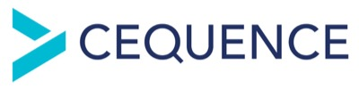

---

layout: col-sidebar
title: OWASP Austin
tags: austin

region: North America

altfooter: true
meetup-group: OWASP-Austin-Chapter
country: USA
postal-code: 78759

---
<!-- rebuild -->
<strong>Home Page</strong>
&nbsp;&nbsp;&nbsp;[Chapter Leadership](leadership.md)
&nbsp;&nbsp;&nbsp;[Study Groups](studygroups.md)
&nbsp;&nbsp;&nbsp;[Past Events](pastevents.md)
&nbsp;&nbsp;&nbsp;[Sponsorship](sponsorship.md)
&nbsp;&nbsp;&nbsp;[Event Archive](pasteventsarchive.md)

Welcome
-------
Welcome to the Austin chapter homepage.

## Upcoming Events ##

### OWASP Austin Chapter Meeting April 2024 ###

**When:** Tuesday, April 30, 2024 @ 11:45 AM - 1:00 PM 
Agenda: 
11:30-11:55 -- Room Opens, food is available and in-room discussions 
11:55-12:05 -- Chapter/OWASP info presentation 
12:05-1  -- Speaker Presentation 
 
**Presentation: The Truman Show: Real-world application attacks instead of canned demos**

In this presentation, Kevin Johnson of Secure Ideas will walk attendees through various scenarios used in penetration testing of applications.  These demonstrations will use real attacks and discuss how a penetration tester views applications.  This talk will explain the mindset of an attacker, using actual applications as well as demonstration apps to allow for exploitation.
  
**Speaker:** 
Kevin Johnson

Kevin Johnson is CEO of Secure Ideas, a consulting company dedicated to security testing and training. Kevin passionately advocates for cybersecurity through his work with Secure Ideas, as a global board member for OWASP and as a faculty member at IANS. During his over 30 years in the industry, Kevin acted as an instructor and author for the SANS institute. He also contributed to a number of open-source projects, including OWASP SamuraiWTF (a web pen-testing training environment), Laudanum (a collection of injectable web payloads) and Yokoso (an infrastructure fingerprinting project) and was the founder and lead of the BASE project for Snort. Kevin has served as an expert witness in court cases involving cybersecurity.

RSVP: 
Eventbrite (in-person RSVP) - <a href="https://www.eventbrite.com/e/owasp-austin-chapter-monthly-meeting-april-2024-group-1-tickets-879128425787">Eventbrite</a> 
Meetup (online RSVP) - <a href="https://www.meetup.com/owasp-austin-chapter/events/298207001/">Meetup</a>

[back to top](#welcome)

### Austin Security Professionals Happy Hour sponsored by Cequence, May 9, 2024 ###

**When:** Thursday, May 9th, 5:30 pm - 7:30 pm

**Where:** Lavaca Street Bar at the Domain Northside (Rock Rose District), 11420 Rock Rose Ave #100, Austin, TX 78758.  We will have tables reserved inside the bar, to the right as you enter.  Parking: nearest parking in the Red Garage located off of Rock Rose Ave (<a href="https://domainnorthside.com/map/" target="_blank">map of Domain</a>). 

**What:** The Austin Security Professionals Happy Hour is a monthly event coordinated by the Austin OWASP Chapter and sponsored by various companies. We try to meet every second Thursday of the month from January to September (but occasionally we make schedule adjustments when needed). The event is an informal social gathering of local information security professionals. If you're involved with InfoSec or even if you have an interest, come on out for drinks, good food and conversation.

**Sponsor:** <a href="https://www.cequence.ai/" target="_blank">Cequence</a>  
  

<em>Cequence, a pioneer in API Security, is the only vendor with a comprehensive Unified API Protection solution offering discovery, compliance, and protection across all internal and external APIs to defend against attacks, targeted abuse, and fraud. Onboard APIs in less than 15 minutes, without needing any instrumentation, SDK, or JavaScript deployments. Cequence solutions scale to handle the most demanding government, Fortune and Global 2000 organizations, securing more than 8 billion daily API calls and protecting more than 3 billion user accounts across these customers. Its flexible deployment model supports passive/inline, on-premises, SaaS, and hybrid deployments.</em>

Please RSVP so we can plan for number of attendees: 
<a href="https://www.meetup.com/owasp-austin-chapter/events/299656219/" target="_blank"> Meetup </a>
  

[back to top](#welcome)

### Austin Security Professionals Happy Hour, June 13, 2024 - SAVE THE DATE ###

**When:** Thursday, June 13th, 5:30 pm - 7:30 pm

**Where:** Lavaca Street Bar at the Domain Northside (Rock Rose District), 11420 Rock Rose Ave #100, Austin, TX 78758.  We will have tables reserved inside the bar, to the right as you enter.  Parking: nearest parking in the Red Garage located off of Rock Rose Ave (<a href="https://domainnorthside.com/map/" target="_blank">map of Domain</a>). 

**What:** The Austin Security Professionals Happy Hour is a monthly event coordinated by the Austin OWASP Chapter and sponsored by various companies. We try to meet every second Thursday of the month from January to September (but occasionally we make schedule adjustments when needed). The event is an informal social gathering of local information security professionals. If you're involved with InfoSec or even if you have an interest, come on out for drinks, good food and conversation.

More details will be announced. Stay tuned!

<!--- **Sponsor:** <a href="company-url-here" target="_blank">TBA</a>
  

<em>TBA</em>
 -->

<!--  
Please RSVP so we can plan for number of attendees: 
<a href="https://www.meetup.com/owasp-austin-chapter/events/????/" target="_blank"> Meetup </a> 
   -->

[back to top](#welcome)

### LASCON 2024 ###

Save the Date for LASCON 2024. We will be back at Norris Conference Center with Pre-Conference Training October 22-23, 2024 and Conference October 24-25, 2024. Visit <a href="https://lascon.org/" target="_blank">lascon.org</a>.

<ul><li><a href="https://lascon.org/tickets/" target="_blank">Discounted tickets are available. Get yours today!</a></li>
<li>Call for Presentations (CFP) open until <strong>Saturday, June 1, 2024</strong>. <a href="https://lascon.org/cfp/" target="_blank">Submit your CFP today!</a></li>
<li>Call for Training (CFT) open until <strong>July 30, 2024</strong>. <a href="https://lascon.org/cft/" target="_blank">Submit your CFT today!</a></li>
<li>Interested in sponsoring LASCON 2024? <a href="https://lascon.org/become-a-sponsor/" target="_blank">Become a Sponsor.</a></li>
</ul>

[back to top](#welcome)

### Austin Security Professionals Happy Hour - 2024 Dates Available ###

> **Interested in Sponsoring? We are currently seeking happy hour sponsors for our monthly event. Please contact <a href="mailto:tiana.chandler@owasp.org?subject=OWASP Happy Hour Sponsor">Tiana Chandler</a> if you are interested. See our <a href="https://owasp.org/www-chapter-austin/sponsorship.html">Sponsorship</a> page for information on sponsoring.**

[back to top](#welcome)

Chapter Supporters
----------------
The following are the list of OWASP Corporate Members who have generously aligned themselves with the Austin chapter, therefore contributing funds to our chapter:

<table cellpadding="15" cellspacing="0">
<tr>
<td>

</td>
</tr>
</table>

Meeting Supporters
----------------
The following are the list of organizations who have generously provided meeting space for the Austin chapter:
<table cellpadding="15" cellspacing="0">
<tr>
<td>
  
</td>
</tr>
</table>

General Supporters
----------------
The following are the list of organizations who have generously provided additional assistance for the Austin chapter:
<table cellpadding="15" cellspacing="0">
<tr>
<td>
  
</td>
</tr>
</table>

[back to top](#welcome)
