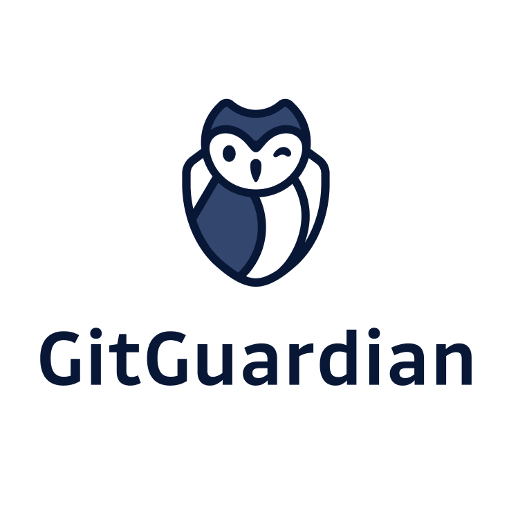

---

layout: col-sidebar
title: OWASP Austin
tags: austin

region: North America

altfooter: true
meetup-group: OWASP-Austin-Chapter
country: USA
postal-code: 78759

---
<!-- rebuild -->
<strong>Home Page</strong>
&nbsp;&nbsp;&nbsp;[Chapter Leadership](leadership.md)
&nbsp;&nbsp;&nbsp;[Study Groups](studygroups.md)
&nbsp;&nbsp;&nbsp;[Past Events](pastevents.md)
&nbsp;&nbsp;&nbsp;[Sponsorship](sponsorship.md)
&nbsp;&nbsp;&nbsp;[Event Archive](pasteventsarchive.md)

Welcome
-------
Welcome to the Austin chapter homepage. The Chapter Leader is Kyle Smith. See below for [full list of all chapter leadership board](leadership.md).

## Upcoming Events



### OWASP Austin Chapter Meeting April 26th 2022 ###

**When:** Tuesday, April 26th, 2022 @ 11:30 AM - 1:00 PM

**Title:Securing the Edge** 
<blockquote> 
We are moving to a new era of compute that is more democratized than ever, underpinned by 5G networks, and focused on “things enabled” experiences. We are moving closer to the edge!
Edge can bring network and security closer together. Compared with legacy security controls, edge security controls need to provide broader, more centralized visibility across the entire attack surface.
</blockquote>

**Speaker:** 
<blockquote>
Join Theresa Lanowitz, Head of Cybersecurity Evangelism, AT&T Business as she reveals the findings of the most recent AT&T Cybersecurity Insights Report and discusses common architectures, use cases, and the perceived risk associated with edge deployments.
</blockquote>
 
RSVP: 
<a href="https://owasp-austin-2022-april.eventbrite.com">Eventbrite</a> 
<a href="https://www.meetup.com/OWASP-Austin-Chapter/events/285199340/">Meetup (online)</a> 
<a href="https://www.meetup.com/OWASP-Austin-Chapter/events/285199315/">Meetup (in-person)</a> 

### TBA - Austin Security Professionals Happy Hour, 2022 ###

We will be evaluating when to begin having in-person Happy Hour events. Be sure to sign up for the <a href="https://groups.google.com/a/owasp.org/g/austin-chapter" target="_blank">Austin Chapter mailing list</a> to get up-to-date announcements.

[back to top](#welcome)

### LASCON 2022 - SAVE THE DATES! ###

We are already planning for LASCON 2022. We plan to be back in person at Norris Conference Center with Pre-Conference Training October 25-26, 2022 and Conference October 27-28, 2022. Visit <a href="https://lascon.org/" target="_blank">lascon.org</a> for more information on upcoming CFP, CFT, and early bird discounted tickets.

Chapter Supporters
----------------
The following are the list of OWASP Corporate Members who have generously aligned themselves with the Austin chapter, therefore contributing funds to our chapter:

<table cellpadding="15" cellspacing="0">
<tr>
<td>

</td>
</tr>
</table>

Meeting Supporters
----------------
The following are the list of organizations who have generously provided meeting space for the Austin chapter:
<table cellpadding="15" cellspacing="0">
<tr>
<td>
  
</td>
</tr>
</table>

General Supporters
----------------
The following are the list of organizations who have generously provided additional assistance for the Austin chapter:
<table cellpadding="15" cellspacing="0">
<tr>
<td>
  
</td>
</tr>
</table>

[back to top](#welcome)
