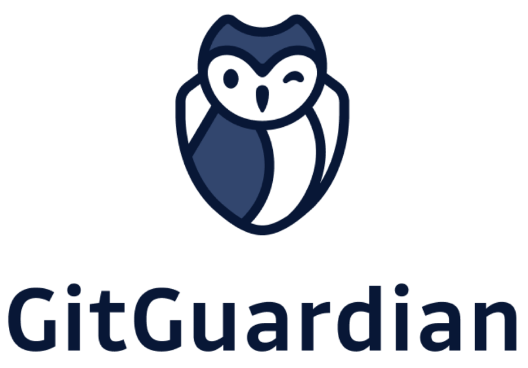

---

layout: col-sidebar
title: OWASP Austin
tags: austin

region: North America

altfooter: true
meetup-group: OWASP-Austin-Chapter
country: USA
postal-code: 78759

---
<!-- rebuild -->
<strong>Home Page</strong>
&nbsp;&nbsp;&nbsp;[Chapter Leadership](leadership.md)
&nbsp;&nbsp;&nbsp;[Study Groups](studygroups.md)
&nbsp;&nbsp;&nbsp;[Past Events](pastevents.md)
&nbsp;&nbsp;&nbsp;[Sponsorship](sponsorship.md)
&nbsp;&nbsp;&nbsp;[Event Archive](pasteventsarchive.md)

Welcome
-------
Welcome to the Austin chapter homepage.

## Upcoming Events ##

### OWASP Austin Chapter Meeting May 2024 ###

**When:** Tuesday, May 28th 2024 @ 11:45 AM - 1:00 PM 
Agenda: 
11:30-11:55 -- Room Opens, food is available and in-room discussions 
11:55-12:05 -- Chapter/OWASP info presentation 
12:05-1  -- Speaker Presentation 
 
**Presentation: Digital Deceit and AI Hallucinations: Safeguarding the Software Supply Chain**

The presentation unites Tyler Agypt's expertise in a riveting exploration of software supply chain threats, spanning traditional dangers to the novel challenge of AI Package Hallucination. Agypt, VP of Global Enablement at Checkmarx, exposes the hidden risks in software dependencies and the emerging threat of artificially generated, nonexistent code packages. Through real-world examples and insights from over 1 million malicious packages, he reveals the deceptive practices endangering our digital ecosystem, from Dependency Confusion to Star-Jacking to Repo-Jacking.

Agypt advocates for robust defensive strategies, tools and improved dependency management, to counteract these threats. This presentation is a call to action for the developer and cybersecurity community to elevate their vigilance and adopt a proactive stance against the evolving challenges in software supply chain security. Join this enlightening session for a comprehensive understanding of both traditional and AI-induced vulnerabilities, and equip yourself to better face tomorrow's cybersecurity challenges.

  
**Speaker:** 
Tyler Agypt

Tyler Agypt, VP of Global Enablement at Checkmarx, is an Application Security evangelist and tech enthusiast. With a career focused on the intersection of software development and AppSec, Tyler brings a deep understanding of how to combat emerging threats within applications. Known for his voracious appetite for learning and problem-solving, he delves into customer AppSec programs, offering insights into tackling security challenges. Tyler's unique combination of expertise, passion, and approachability makes his speeches a must-see, promising attendees not just valuable learnings but also inspiration to delve deeper into the world of Application Security.

RSVP: 
Eventbrite (in-person RSVP) - <a href="https://www.eventbrite.com/e/owasp-austin-chapter-monthly-meeting-may-2024-group-1-tickets-903619619607?aff=oddtdtcreator">Eventbrite</a> 
Meetup (online RSVP) - <a href="https://www.meetup.com/owasp-austin-chapter/events/298207005/">Meetup</a>
 
[back to top](#welcome)

### Austin Security Professionals Happy Hour, June 13, 2024 - SAVE THE DATE ###

**When:** Thursday, June 13th, 5:30 pm - 7:30 pm

**Where:** Lavaca Street Bar at the Domain Northside (Rock Rose District), 11420 Rock Rose Ave #100, Austin, TX 78758.  We will have tables reserved inside the bar, to the right as you enter.  Parking: nearest parking in the Red Garage located off of Rock Rose Ave (<a href="https://domainnorthside.com/map/" target="_blank">map of Domain</a>). 

**What:** The Austin Security Professionals Happy Hour is a monthly event coordinated by the Austin OWASP Chapter and sponsored by various companies. We try to meet every second Thursday of the month from January to September (but occasionally we make schedule adjustments when needed). The event is an informal social gathering of local information security professionals. If you're involved with InfoSec or even if you have an interest, come on out for drinks, good food and conversation.

More details will be announced. Stay tuned!

<!--- **Sponsor:** <a href="company-url-here" target="_blank">TBA</a>
  

<em>TBA</em>
 -->

<!--  
Please RSVP so we can plan for number of attendees: 
<a href="https://www.meetup.com/owasp-austin-chapter/events/????/" target="_blank"> Meetup </a> 
   -->

[back to top](#welcome)

### LASCON 2024 ###

Save the Date for LASCON 2024. We will be back at Norris Conference Center with Pre-Conference Training October 22-23, 2024 and Conference October 24-25, 2024. Visit <a href="https://lascon.org/" target="_blank">lascon.org</a>.

<ul><li><a href="https://lascon.org/tickets/" target="_blank">Discounted tickets are available. Get yours today!</a></li>
<li>Call for Presentations (CFP) open until <strong>Saturday, June 1, 2024</strong>. <a href="https://lascon.org/cfp/" target="_blank">Submit your CFP today!</a></li>
<li>Call for Training (CFT) open until <strong>July 30, 2024</strong>. <a href="https://lascon.org/cft/" target="_blank">Submit your CFT today!</a></li>
<li>Interested in sponsoring LASCON 2024? <a href="https://lascon.org/become-a-sponsor/" target="_blank">Become a Sponsor.</a></li>
</ul>

[back to top](#welcome)

### Austin Security Professionals Happy Hour - 2024 Dates Available ###

> **Interested in Sponsoring? We are currently seeking happy hour sponsors for our monthly event. Please contact <a href="mailto:tiana.chandler@owasp.org?subject=OWASP Happy Hour Sponsor">Tiana Chandler</a> if you are interested. See our <a href="https://owasp.org/www-chapter-austin/sponsorship.html">Sponsorship</a> page for information on sponsoring.**

[back to top](#welcome)

Chapter Supporters
----------------
The following are the list of OWASP Corporate Members who have generously aligned themselves with the Austin chapter, therefore contributing funds to our chapter:

<table cellpadding="15" cellspacing="0">
<tr>
<td>

</td>
</tr>
</table>

Meeting Supporters
----------------
The following are the list of organizations who have generously provided meeting space for the Austin chapter:
<table cellpadding="15" cellspacing="0">
<tr>
<td>
  
</td>
</tr>
</table>

General Supporters
----------------
The following are the list of organizations who have generously provided additional assistance for the Austin chapter:
<table cellpadding="15" cellspacing="0">
<tr>
<td>
  
</td>
</tr>
</table>

[back to top](#welcome)
