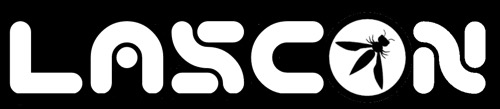

---

layout: col-sidebar
title: OWASP Austin
tags: austin

region: North America

altfooter: true
meetup-group: OWASP-Austin-Chapter
country: USA
postal-code: 78759

---
<!-- rebuild -->
<strong>Home Page</strong>
&nbsp;&nbsp;&nbsp;[Chapter Leadership](leadership.md)
&nbsp;&nbsp;&nbsp;[Study Groups](studygroups.md)
&nbsp;&nbsp;&nbsp;[Past Events](pastevents.md)
&nbsp;&nbsp;&nbsp;[Sponsorship](sponsorship.md)
&nbsp;&nbsp;&nbsp;[Event Archive](pasteventsarchive.md)

Welcome
-------
Welcome to the Austin chapter homepage.

### Upcoming Events ###

### Austin Security Professionals Happy Hour sponsored by Cequence, January 16, 2025 (rescheduled) ###

**When:** Thursday, January 16th, 5:30 pm - 7:30 pm (was rescheduled due to inclement weather)

**Where:** Lavaca Street Bar at the Domain Northside (Rock Rose District), 11420 Rock Rose Ave #100, Austin, TX 78758.  We will have tables reserved inside the bar, to the right as you enter.  Parking: nearest parking in the Red Garage located off of Rock Rose Ave (<a href="https://domainnorthside.com/map/" target="_blank">map of Domain</a>). 

**What:** The Austin Security Professionals Happy Hour is a monthly event coordinated by the Austin OWASP Chapter and sponsored by various companies. We try to meet every second Thursday of the month from January to September (but occasionally we make schedule adjustments when needed). The event is an informal social gathering of local information security professionals. If you're involved with InfoSec or even if you have an interest, come on out for drinks, good food and conversation.

**Sponsor:** <a href="https://www.cequence.ai/" target="_blank">Cequence</a>
  

<em>Cequence, a pioneer in API Security, is the only vendor with a comprehensive Unified API Protection solution offering discovery, compliance, and protection across all internal and external APIs to defend against attacks, targeted abuse, and fraud. Onboard APIs in less than 15 minutes, without needing any instrumentation, SDK, or JavaScript deployments. Cequence solutions scale to handle the most demanding government, Fortune and Global 2000 organizations, securing more than 8 billion daily API calls and protecting more than 3 billion user accounts across these customers. Its flexible deployment model supports passive/inline, on-premises, SaaS, and hybrid deployments.</em>

 
Please RSVP so we can plan for number of attendees: 
<a href="https://www.meetup.com/owasp-austin-chapter/events/304571321/" target="_blank"> Meetup </a>
  

[back to top](#welcome)

### LASCON 2025 ###

Save the Dates for LASCON 2025, which will be our 15th year anniversary. We will be back at Norris Conference Center with Pre-Conference Training October 21-22, 2025 and Conference October 23-24, 2025. Visit <a href="https://lascon.org/" target="_blank">lascon.org</a>.

<ul><li>Early Bird Conference tickets are still available. We sold out last year, so <a href="https://lascon.org/tickets/" target="_blank">get yours today!</a></li>
<li>Call for Presentations (CFP) will be made available at a later date. Stay tuned!</li>
<li>Call for Training (CFT) will be made available at a later date. Stay tuned!</li>
<li>Interested in sponsoring LASCON 2025? <a href="https://lascon.org/become-a-sponsor/" target="_blank">Become a Sponsor today!</a></li>
</ul>

[back to top](#welcome)

### Austin Security Professionals Happy Hour - 2025 Dates Available ###

> **Interested in Sponsoring? We are currently seeking happy hour sponsors for our monthly event. Please contact <a href="mailto:tiana.chandler@owasp.org?subject=OWASP Happy Hour Sponsor">Tiana Chandler</a> if you are interested. See our <a href="https://owasp.org/www-chapter-austin/sponsorship.html">Sponsorship</a> page for information on sponsoring.**

[back to top](#welcome)

### OWASP Austin Chapter Meetings will return in January. Stay Tuned! ###

<!--  FOLLOWING COMMENTED OUT FOR FUTURE USE
**When:** Tuesday, January 28, 2025 @ 11:30 AM - 1:00 PM 
Agenda: 
11:30-11:55 -- Room Opens, food is available and in-room discussions 
11:55-12:05 -- Chapter/OWASP info presentation 
12:05-1  -- Speaker Presentation 
 
**Presentation: PRESENTATION-NAME**

The Secure Development Lifecycle (SDL) is a powerful construct that can advance security for both organizations with established security practices by shifting left, and immature organizations seeking a framework to implement security best practices in agile development. NI has been on a journey over the last several years to improve the security of its products driven by customer requirements, their expectations, and increasingly, regulations that require software to be developed with secure methodologies. Security is as much about a mindset and development culture as it is about tools, vulnerabilities, and security technologies. Learn how NI’s adoption of the Secure Development Lifecycle has created a framework for addressing various security challenges in web applications, microservices, and infrastructure.

**Speaker: SPEAKER-NAME** 
 
SPEAKER-BIO.

RSVP: 
In-person (and free lunch) at <a href="EVENTBRITE-LINK">Eventbrite</a>
  
Online RSVP at <a href="MEETUP-LINK">Meetup</a>
  -->
[back to top](#welcome)

Chapter Supporters
----------------
The following are the list of OWASP Corporate Members who have generously aligned themselves with the Austin chapter, therefore contributing funds to our chapter:

 &nbsp;&nbsp;

 
  

Meeting Supporters
----------------
The following are the list of organizations who have generously provided meeting space for the Austin chapter:

  

General Supporters
----------------
The following are the list of organizations who have generously provided additional assistance for the Austin chapter:

  

[back to top](#welcome)
